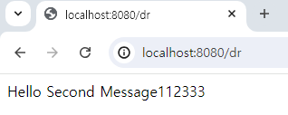
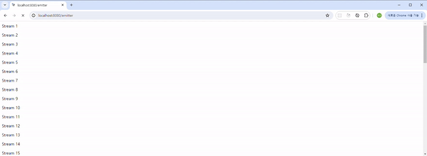

## @Async 비동기 처리 기술

### Completable
Completable 정리(링크)

### DefferredResult 
* 비동기 연산 요청을 보낸 후 대기하다가 이벤트를 보내면 대기 중인 클라이언트 모두에게 결과를 반환함
* 결과 
  
  
  
  

### ResponseBodyEmitter 
* 비동기 요청의 결과를 여러 번 분할해서 보낼 수 있음
  

출처 : https://velog.io/@wwlee94/%EC%8A%A4%ED%94%84%EB%A7%81%EC%9D%98-%EB%B9%84%EB%8F%99%EA%B8%B0-%EC%B2%98%EB%A6%AC-%EA%B8%B0%EC%88%A0-%EC%95%8C%EC%95%84%EB%B3%B4%EA%B8%B0#threadpooltaskexecutor